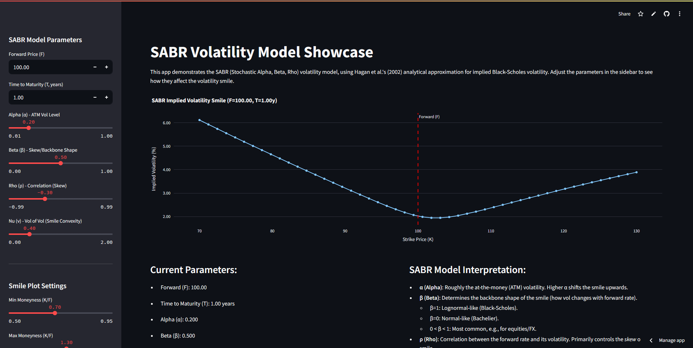

# SABR Volatility Model Showcase with Streamlit



This application provides an interactive interface to explore the SABR (Stochastic Alpha, Beta, Rho) volatility model. It uses the well-known Hagan et al. (2002) analytical approximation to calculate and display the implied Black-Scholes volatility smile.

Users can adjust the core SABR parameters (Alpha, Beta, Rho, Nu) as well as market parameters (Forward Price, Time to Maturity) and observe their impact on the volatility smile in real-time.

## Features

*   **Interactive Parameter Adjustment:** Sliders allow easy modification of:
    *   **Alpha (α):** ATM Volatility Level
    *   **Beta (β):** Skew/Backbone Shape
    *   **Rho (ρ):** Correlation (Skew)
    *   **Nu (ν):** Volatility of Volatility (Smile Convexity)
    *   **Forward Price (F)**
    *   **Time to Maturity (T)**
*   **Dynamic Volatility Smile Plot:** The implied volatility smile (volatility vs. strike) is plotted using Plotly and updates instantly as parameters change.
*   **Customizable Plot Range:** Adjust the minimum and maximum moneyness (K/F) and the number of strike points for the plot.
*   **Parameter Interpretation:** Displays a brief explanation of how each SABR parameter influences the smile.
*   **Formula Display:** Shows the Hagan et al. (2002) approximation formula for the SABR implied volatility.

## Prerequisites

*   Python (3.7+ recommended)
*   pip (Python package installer)

## Installation

1.  **Clone the repository or download the `sabr_app.py` file.**
    (Assuming the Python script is named `sabr_app.py`)

2.  **Install the required Python libraries:**
    Open your terminal or command prompt and run:
    ```bash
    pip install streamlit numpy pandas plotly
    ```

## Running the Application

1.  Navigate to the directory where you saved the `sabr_app.py` file using your terminal.
2.  Run the Streamlit application using the following command:
    ```bash
    streamlit run sabr_app.py
    ```
3.  The application will automatically open in your default web browser. If not, the terminal will provide a local URL (usually `http://localhost:8501`) that you can open manually.

## Understanding the Model

The SABR model is a stochastic volatility model widely used in finance to capture the volatility smile/skew observed in options markets.
The key parameters are:
*   **α (Alpha):** The initial level of (at-the-money) forward volatility.
*   **β (Beta):** An exponent that determines how the volatility changes with the forward price (controls the "backbone" of the smile).
    *   `β = 1` corresponds to a lognormal model (like Black-Scholes).
    *   `β = 0` corresponds to a normal model (Bachelier).
    *   `0 < β < 1` is typical for many asset classes.
*   **ρ (Rho):** The correlation between changes in the forward price and its volatility. This primarily drives the *skew* of the smile.
*   **ν (Nu):** The volatility of volatility (vol-of-vol). This primarily drives the *convexity* or "smileyness" of the curve.

This application implements Hagan's 2002 approximation formula, which provides a closed-form solution for the implied Black-Scholes volatility under the SABR model.
